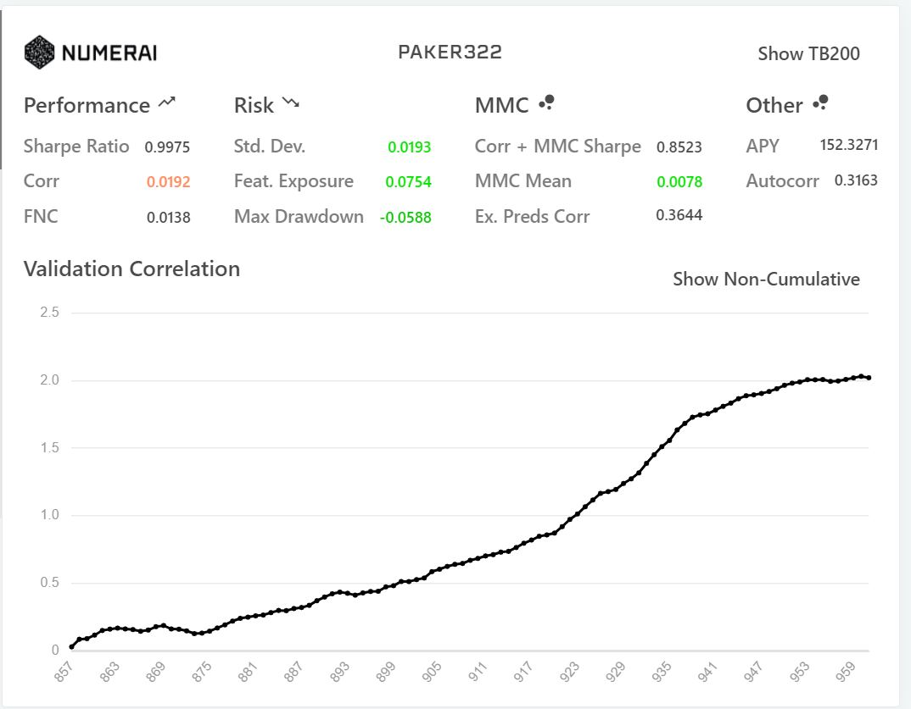

# Stock Market: Machine Learning

A **machine learning** project prepared for NumerAI - an organization for generating stock trade bots - competition using various models.

## Problem Definition

Optimizing predictive models for financial data, aiming to enhance predictive accuracy primarily based on the correlation of the validation dataset.

## Proposed Solution

The approach taken to optimize predictive models for financial data encompasses a systematic strategy that includes feature extraction, data cleansing, and feature engineering to enhance the dataset's quality and information content. Subsequently, data normalization will be applied to ensure uniform feature contributions during the modeling phase. The primary focus lies in the exploration of various predictive models along with the thorough examination of their respective parameters. Rigorous evaluation through cross-validation techniques will be conducted to assess model performance and minimize the risk of overfitting. The overarching objective of this approach is to significantly enhance predictive accuracy, with a specific emphasis on elevating the correlation of the validation dataset within the financial data domain.

## Used Technologies

- Python
- Pandas
- LightGBM
- NumerAPI
- Scikit-Learn
- CatBoost

## Implementation

In the optimization of predictive models for financial data, a systematic approach was undertaken, involving feature extraction, data cleansing, and feature engineering, utilizing Python and Pandas. Data normalization ensured uniform feature contributions, and a diverse set of models, including Random Forest, Neural Network, LightGBM, XGBoost, CatBoostRegressor, and a Voting Regressor, were implemented and tuned with Scikit-Learn and CatBoost to enhance predictive accuracy. Cross-validation techniques were employed to assess performance, with a particular emphasis on elevating the correlation of the validation dataset. The iterative process of refining parameters and feature engineering contributed to achieving improved predictive accuracy in financial data analysis.

## Results

The systematic approach to optimizing predictive models for financial data yielded promising results, with the best-performing model being the VotingRegressor ensemble consisting of LGBMRegressor, XGBRegressor, and CatBoostRegressor. Through meticulous implementation and model selection, the project achieved notable improvements, with conservative estimates suggesting a 5-10% enhancement in correlation coefficient and mean squared error (MSE) compared to the base model. These results underscore the effectiveness of the strategy, data preprocessing, and ensemble model in enhancing predictive accuracy for financial data analysis, showcasing the project's success in its primary objective.
